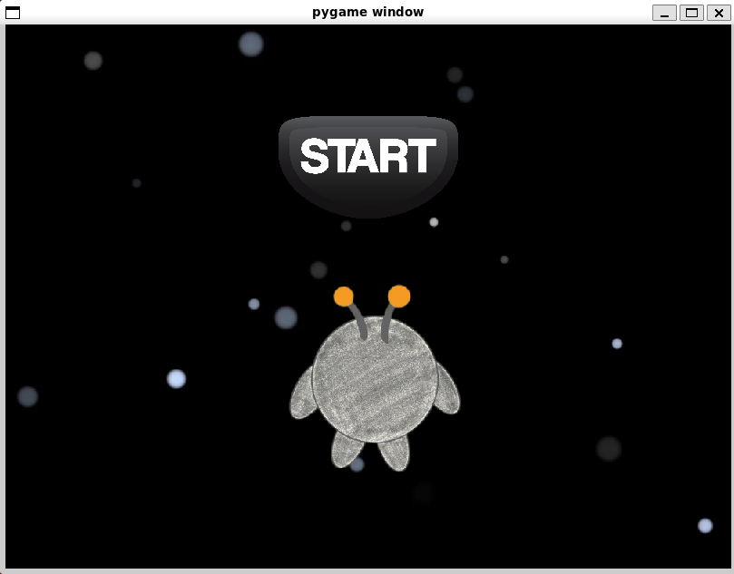
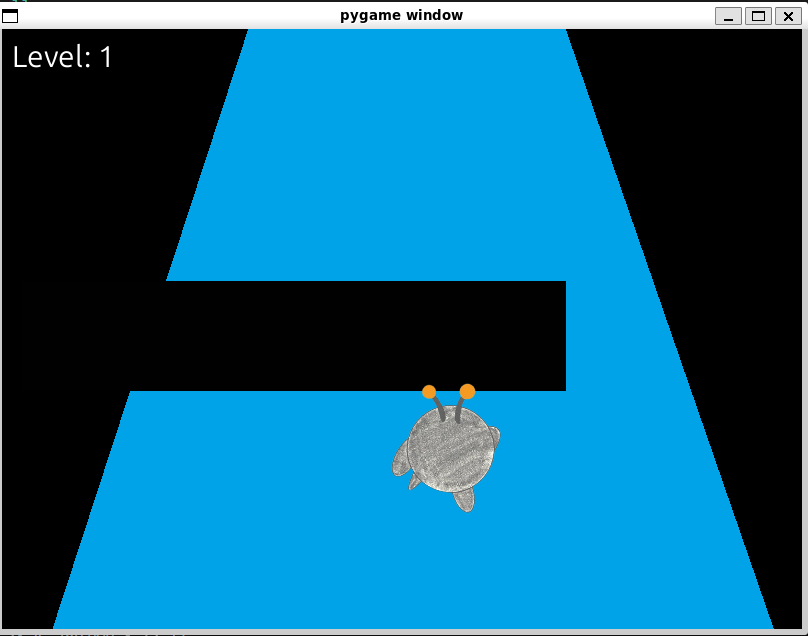
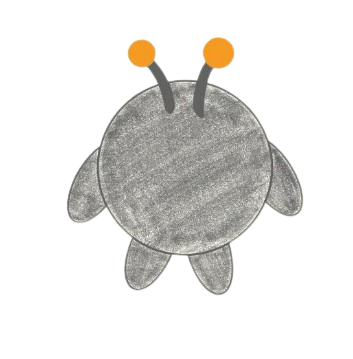

# run-dupe

**Software Design: ENGR2510-02 Spring 2025**

**Project By: Mira Epstein & Kuhu Jayaswal**

*To access our project, kindly navigate to the 'View on GitHub' button at the top of our website!*

[](https://github.com/psf/black)
[](https://github.com/prettier/prettier)


## The Big Idea

Our project is a recreation of the classic Run game series—a fast-paced platformer where the player navigates through tunnels in space without falling into pits. We've designed several levels that increase in difficulty as the character speeds up and more pits appear. Unlike the original rotating tunnel mechanic, we opted for a fixed orientation to make the gameplay more accessible for people who may not be used to playing video games or who have reduced hand dexterity.

We enhanced the original concept by adding a clean, accessible UI and a structured, progressively challenging design. The game is built using the Model-View-Controller (MVC) architecture to keep the code modular and easy to maintain. This structure made it easier to implement features like real-time level tracking and control responsiveness while also allowing for future scalability.

## Code Overview

On the technical side, the project is built using the Model-View-Controller (MVC) design pattern. 

The controller classes can be found in `run_controller.py`. This file contains three classes: `AlienController`, `PitController`, and `StartScreenController`. Each one controls the character, the pits approaching the character, and the button on the start screen respectively.

The view classes can be found in `run_view.py`. This file contains two classes: `GameView` and `StartScreenView`. `GameView` draws the character, the pits approaching the character, the background, and the level counter. `StartScreenView` draws the starting screen background, the start button, and the image displayed when you open the game.

The model class can be found in `run_model.py` and it imports all the classes from `run_controller.py` and `run_view.py` and puts them together into a model class that runs the game (that's why this is the file you run to open the game window).

## How to Play?

### Setup--> Required Software Packages

To run our project on your device, you will need the following libraries (excluding the standard python library).

- `pygame`==2.6.1
- `pytest`==8.3.5

To install these libraries, run the following command in your terminal:

```bash
pip install -r requirements.txt
```

### RUN RUN RUN!

**To run the game, open the file `run_model.py`**

Once launched, you'll see a start screen. Press the "Start" button to begin— there’s no countdown, so be ready to play immediately. You control an alien character running along a platform in space while dodging incoming pits.

Use the arrow keys or WASD to move left and right. Press the space bar to jump. Your objective is to stay alive as long as possible and reach the highest level you can.

You’ll level up after passing five platforms in a single run. For the first eight levels, each level-up increases the game’s speed, raising the difficulty. If your character falls into a pit or off the platform, the game ends and resets to the home screen, where you can try again. Your current level is displayed in the top-left corner during gameplay.

This structure allows for quick retries, a progressively harder challenge, and an intuitive control scheme accessible to both new and experienced players.

## Demonstration

Here’s a preview of what the game looks like:

### Start Screen  
This is the first screen the player sees, with a start button and the alien character.



### Gameplay  
As the game begins, your character starts running down a platform filled with gaps.



### Main Character  
This is the alien character you control throughout the game.



## Video


